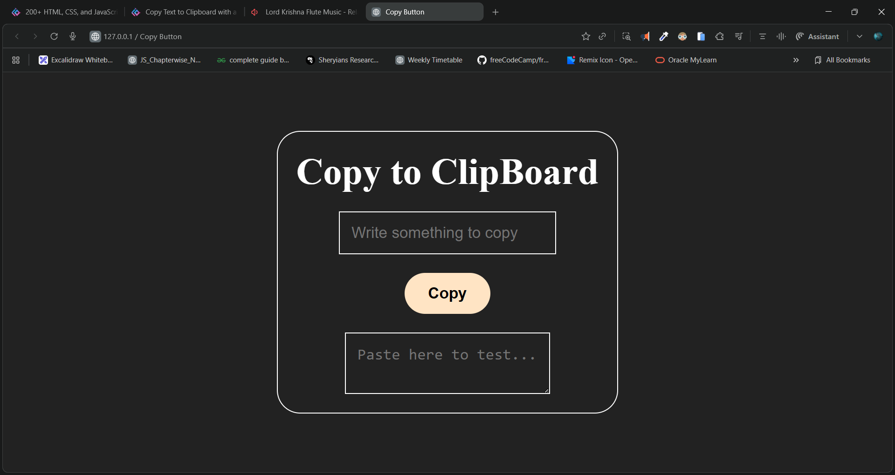

# 🧾 Copy to Clipboard — Mini Project

A simple and stylish web app that lets you **copy text to your clipboard** with one click. Built using **HTML**, **CSS**, and **JavaScript**, this project demonstrates how to interact with the modern Clipboard API in a clean, user-friendly interface.

---

## 🚀 Demo


🖼️ **Preview Screenshot:**



🎥 **[Watch Demo Video](./demo.mp4)**

🔗 **Live Demo : https://dileep-kumawat.github.io/copy-to-clipboard-using-html-css-and-js/**

---

## ✨ Features

* ✅ Copy any text to your clipboard with a single click
* ✅ Instant feedback ("Copied!") message after action
* ✅ Responsive, centered layout
* ✅ Clean and modern design using vanilla CSS
* ✅ Lightweight — no external libraries needed

---

## 🧩 Tech Stack

* **HTML5** – Structure
* **CSS3** – Styling and layout
* **JavaScript (ES6+)** – Clipboard functionality

---

## 🧠 How It Works

1. Enter text into the input field.
2. Click the **Copy** button.
3. The text is copied to your system clipboard instantly.
4. You can paste it anywhere (try the textarea below to test it).

---

## 📂 Project Structure

```
📁 Copy-to-Clipboard
│
├── index.html      # Main HTML structure
├── style.css       # Styling and layout
└── script.js       # Clipboard functionality
```

---

## 🧑‍💻 Author

**Dileep kumawat**
📧 Email: [dileepkumawat525@gmail.com](mailto:dileepkumawat525@gmail.com)

---

## 🪪 License

This project is licensed under the **MIT License** — feel free to use and modify it!